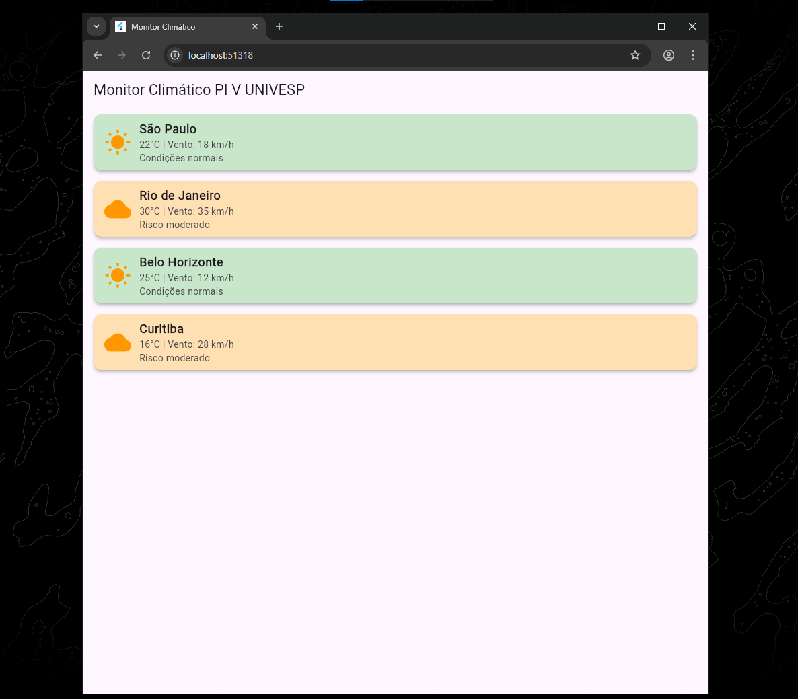
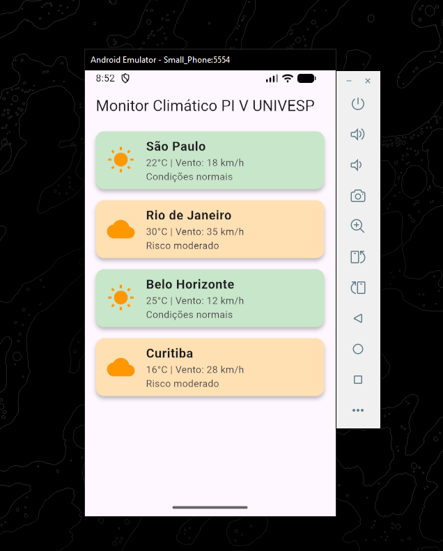
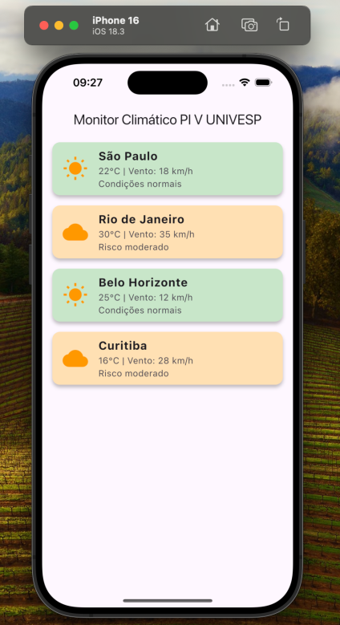
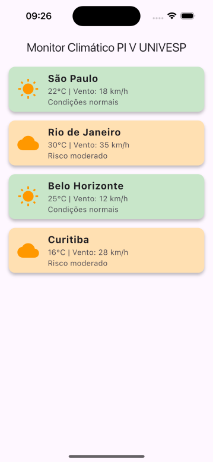

# Rastreamento de Condições Climáticas

## 1. Descrição Geral

O projeto **Rastreamento de Condições Climáticas** consiste no desenvolvimento de um aplicativo móvel multiplataforma utilizando o framework Flutter, responsável por consumir, interpretar e exibir dados climáticos provenientes de uma fonte remota em formato JSON.

O sistema foi concebido dentro do contexto de aplicações de Internet das Coisas (IoT), simulando a coleta de dados de estações meteorológicas conectadas à internet. O aplicativo atua como camada de aplicação do sistema, sendo responsável pela aquisição, processamento e apresentação das informações ao usuário final.

A solução demonstra a integração entre dispositivos geradores de dados (simulados), infraestrutura de comunicação baseada em internet e interface móvel para visualização e análise.

Este projeto atende às seguintes plataformas:

- WEB (execução via navegador utilizando Flutter Web);
- MOBILE (Android e iOS);
- DESKTOP (Windows - geração de executável .exe);
- DESKTOP (macOS);
- DESKTOP (Linux).

A utilização do Flutter como framework de desenvolvimento permite que o mesmo código-fonte seja compilado para múltiplos ambientes, mantendo consistência visual, lógica de negócio unificada e redução significativa de retrabalho entre plataformas.

A abordagem multiplataforma adotada neste projeto proporciona:

- Portabilidade do sistema;
- Facilidade de manutenção;
- Escalabilidade para diferentes dispositivos;
- Maior alcance de usuários;
- Redução de custos de desenvolvimento.

Dessa forma, o sistema demonstra não apenas integração com conceitos de IoT, mas também aplicação prática de desenvolvimento multiplataforma moderno.

Abaixo segue prints da execução da aplicação em diferentes plataformas:

- WEB;
- Android Emulador;
- IOS Emulador;
- IOS Dispositivo Físico;






---

### 1.1 Ferramentas e Tecnologias Utilizadas

O desenvolvimento do projeto foi realizado com o suporte das seguintes ferramentas e tecnologias:

- **Visual Studio Code (VS Code)** — Ambiente de desenvolvimento integrado (IDE) utilizado para implementação, organização e depuração do código-fonte;
- **Flutter SDK** — Framework multiplataforma adotado para o desenvolvimento da interface e da lógica da aplicação;
- **Dart** — Linguagem de programação utilizada pelo Flutter para implementação das regras de negócio e manipulação dos dados;
- **Package HTTP** — Biblioteca utilizada para realização de requisições web e consumo do arquivo JSON remoto;
- **Git e GitHub** — Controle de versão e hospedagem do arquivo JSON que simula a fonte de dados IoT;
- **Navegador Web (Chrome/Edge)** — Utilizado para testes da versão Flutter Web;
- **Emulador Android / Dispositivo físico** — Utilizado para testes da versão mobile.
- **Emulador IOS / Dispositivo físico** — Utilizado para testes da versão mobile.

A escolha dessas ferramentas foi baseada em critérios como portabilidade, facilidade de integração, suporte multiplataforma e ampla documentação técnica disponível.

A combinação dessas tecnologias permitiu o desenvolvimento de uma aplicação leve, escalável e compatível com diferentes ambientes de execução, mantendo organização e padronização no processo de implementação.

---

## 1.2 Como rodar a aplicação

### Pré-requisitos

Antes de iniciar, certifique-se de ter instalado:

* Flutter (versão estável recomendada)
* Dart (já incluso no Flutter)
* Android Studio ou Visual Studio Code
* Um dispositivo físico ou emulador configurado
* (Opcional para Web) Navegador como Google Chrome

Verifique sua instalação com:

```bash
flutter doctor
```

---

### Passos para executar o projeto

#### 1️⃣ Clonar o repositório

```bash
git clone https://github.com/matheusjferreira/flutter-clima-app
```

```bash
cd flutter-clima_app
```

---

#### 2️⃣ Instalar as dependências

```bash
flutter pub get
```

---

#### 3️⃣ Executar a aplicação

##### Android / iOS

```bash
flutter run
```

---

##### Web

```bash
flutter run -d chrome
```

---

##### Gerar build de produção

- Android

```bash
flutter build apk --release
```

- WEB

```bash
flutter build web
```

O build será gerado em:

```
build/web/
```

---

## 2. Objetivo do Projeto

Desenvolver um sistema capaz de:

- Realizar requisições HTTP para obtenção de dados climáticos remotos;
- Interpretar e estruturar as informações recebidas em formato JSON;
- Classificar condições ambientais com base em regras pré-definidas;
- Apresentar múltiplas cidades em uma interface organizada e responsiva;
- Demonstrar arquitetura compatível com sistemas IoT reais.

---

## 3. Contextualização em IoT

A Internet das Coisas (IoT) é caracterizada pela interconexão de dispositivos capazes de coletar e transmitir dados por meio da internet. Em uma arquitetura típica de IoT, existem três camadas principais:

### 3.1 Camada de Dispositivos (Things)
Responsável pela geração dos dados ambientais.  
No presente projeto, essa camada é simulada por um arquivo JSON hospedado remotamente, representando estações meteorológicas.

### 3.2 Camada de Comunicação
Responsável pela transmissão dos dados via rede utilizando protocolos baseados em HTTP.

### 3.3 Camada de Aplicação
Representada pelo aplicativo desenvolvido em Flutter, responsável por:

- Consumir os dados remotos;
- Processar e classificar as informações;
- Exibir resultados ao usuário;
- Destacar situações de risco.

Essa estrutura mantém compatibilidade total com futuras integrações com sensores físicos reais.

---

## 4. Tecnologias Utilizadas

- **Flutter** — Desenvolvimento da interface mobile multiplataforma;
- **Dart** — Linguagem de programação do aplicativo;
- **HTTP Package** — Realização de requisições web;
- **GitHub** — Hospedagem do arquivo JSON remoto;
- **JSON** — Estrutura de troca de dados.

---

## 5. Arquitetura do Sistema

O fluxo operacional do sistema pode ser descrito da seguinte forma:

    Fonte de Dados (JSON remoto)
    ↓
    Requisição HTTP (GET)
    ↓
    Decodificação JSON
    ↓
    Modelagem dos Dados (Weather)
    ↓
    Processamento e Classificação
    ↓
    Interface Mobile (Flutter)

A arquitetura adota um modelo cliente-servidor simplificado, onde o aplicativo atua como consumidor de dados.

---

## 6. Estrutura dos Dados

Os dados climáticos são estruturados em formato JSON contendo múltiplas cidades, com os seguintes atributos:

- cidade (String)
- temperatura (°C)
- chuva (Booleano)
- vento_kmh (Inteiro)

Exemplo:

```json
[
  {
    "cidade": "São Paulo",
    "temperatura": 22,
    "chuva": false,
    "vento_kmh": 18
  }
]
```

---

## 7. Processamento e Análise de Dados

O aplicativo realiza processamento básico das informações recebidas, incluindo:

- Classificação de condições normais;

- Identificação de risco moderado (chuva + vento elevado);

- Geração de alerta para ventos fortes;

- Alteração visual da interface conforme o nível de risco.

Esse processamento caracteriza análise de dados dentro do contexto IoT, mesmo com regras simples.

---

## 8. Funcionalidades Implementadas

- Consumo de dados via requisição HTTP;

- Conversão de JSON para objetos tipados;

- Listagem dinâmica de múltiplas cidades;

- Classificação automática das condições climáticas;

- Indicação visual por cores;

- Ícones representando condição do tempo;

- Tratamento básico de erro de conexão.

---

## 9. Escalabilidade e Evolução

A arquitetura foi projetada para permitir futura expansão, incluindo:

- Integração com sensores físicos reais (ESP32, Arduino, etc.);

- Persistência local de dados;

- Implementação de gráficos históricos;

- Notificações push para alertas críticos;

- Integração com APIs meteorológicas públicas.

---

## 10. Considerações Finais

O projeto demonstra a aplicação prática de conceitos fundamentais de Internet das Coisas ao integrar coleta remota de dados, processamento básico e visualização mobile.

Mesmo utilizando uma fonte de dados simulada, a arquitetura permanece compatível com sistemas embarcados reais, permitindo evolução futura sem alterações estruturais significativas.

A solução atende aos objetivos propostos ao apresentar:

- Comunicação remota;

- Processamento de dados;

- Interface de usuário funcional;

- Organização arquitetural adequada;

- Escalabilidade planejada.

Trata-se de uma implementação enxuta, porém tecnicamente coerente com os princípios de sistemas IoT.

---

## 11. Grupo (Integrantes e Responsáveis)

Abaixo estão os integrantes do projeto, responsáveis pelo desenvolvimento, implementação e manutenção da aplicação:

- **Larissa Machado** — GitHub: @machaadolarissa
- **Henrique Pinheiro** — GitHub: @pinheiro000
- **Vitor Miura** — GitHub: @vitormiura
- **Elisângela da Silva**
- **Takeyama Pablo**
- **Yasmin Oscarlino**
- **Matheus Ferreira** — GitHub: @matheusjferreira

Os integrantes identificados com conta no GitHub participaram ativamente da implementação técnica, versionamento e organização do código-fonte. Os demais membros contribuíram nas etapas de planejamento, documentação, validação e testes do sistema.

---

## 12. Licença

MIT License

Copyright (c) 2025 Matheus Ferreira

Permission is hereby granted, free of charge, to any person obtaining a copy
of this software and associated documentation files (the "Software"), to deal
in the Software without restriction, including without limitation the rights
to use, copy, modify, merge, publish, distribute, sublicense, and/or sell
copies of the Software, and to permit persons to whom the Software is
furnished to do so, subject to the following conditions:

The above copyright notice and this permission notice shall be included in all
copies or substantial portions of the Software.

THE SOFTWARE IS PROVIDED "AS IS", WITHOUT WARRANTY OF ANY KIND, EXPRESS OR
IMPLIED, INCLUDING BUT NOT LIMITED TO THE WARRANTIES OF MERCHANTABILITY,
FITNESS FOR A PARTICULAR PURPOSE AND NONINFRINGEMENT. IN NO EVENT SHALL THE
AUTHORS OR COPYRIGHT HOLDERS BE LIABLE FOR ANY CLAIM, DAMAGES OR OTHER
LIABILITY, WHETHER IN AN ACTION OF CONTRACT, TORT OR OTHERWISE, ARISING FROM,
OUT OF OR IN CONNECTION WITH THE SOFTWARE OR THE USE OR OTHER DEALINGS IN THE
SOFTWARE.
